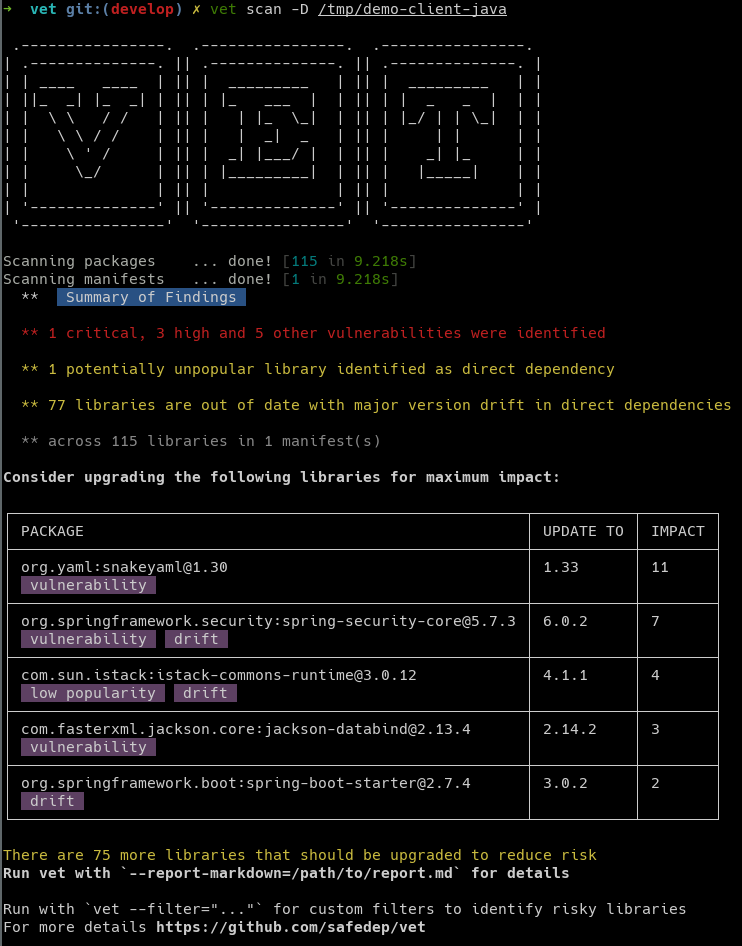

# vet 

`vet` is a tool for identifying risks in open source software supply chain. It
helps engineering and security teams to identify potential issues in their open
source dependencies and evaluate them against organizational policies.

[](https://api.securityscorecards.dev/projects/github.com/safedep/vet)
[](https://github.com/safedep/vet/actions/workflows/codeql.yml)
[](https://github.com/safedep/vet/actions/workflows/scorecard.yml)

## Demo

[](https://asciinema.org/a/I60aD2VtVsETQtIFsYTCewJZ3)

## TL;DR

Scan a repository for OSS dependency risks with auto-detection of package
manifests

```bash
vet scan -D /path/to/repo
```



[Example Security Gate](https://github.com/safedep/demo-client-java/pull/2)
using `vet` to prevent introducing new OSS dependency risk in an application.

## Getting Started

> Ensure `$(go env GOPATH)/bin` is in your `$PATH`

Install using `go get`

```bash
go install github.com/safedep/vet@latest
```

Alternatively, look at [Releases](https://github.com/safedep/vet/releases) for
a pre-built binary for your platform. [SLSA Provenance](https://slsa.dev/provenance/v0.1) is published
along with each binary release.

Get a trial API key for [Insights API](https://safedep.io/docs/concepts/raya-data-platform-overview) access

```bash
vet auth trial --email john.doe@example.com
```

> A time limited trial API key will be sent over email.

Configure `vet` to use API Key to access [Insights API](https://safedep.io/docs/concepts/raya-data-platform-overview)

```bash
vet auth configure
```

> Insights API is used to enrich OSS packages with meta-data for rich query and policy
> decisions

Run `vet` to identify risks

```bash
vet scan -D /path/to/repository
```

or scan a specific (supported) package manifest

```bash
vet scan --lockfiles /path/to/pom.xml
vet scan --lockfiles /path/to/requirements.txt
vet scan --lockfiles /path/to/package-lock.json
```

or scan a supported package manifest with a non-standard name

```bash
vet scan --lockfiles /path/to/gradle-compileOnly.lock --lockfile-as gradle.lockfile
```

> Use `vet scan parsers` to list supported package manifest parsers

The default scan uses an opinionated [Summary Reporter](#) which presents
a consolidated summary of findings. Thats NOT about it. Read more for
expression based filtering and policy evaluation.

## Filtering

Find dependencies that seems not very popular

```bash
vet scan --lockfiles /path/to/pom.xml --report-summary=false \
    --filter='projects.exists(x, x.stars < 10)'
```

Find dependencies with a critical vulnerability

```bash
vet scan --lockfiles /path/to/pom.xml --report-summary=false \
    --filter='vulns.critical.exists_one(x, true)'
```

> Use filtering along with `query` command for offline slicing and dicing of
> enriched package manifests. Read [filtering guide](docs/filtering.md)


Learn more about [filtering with vet](docs/filtering.md). 
Look at [filter input spec](api/filter_input_spec.proto) on attributes
available to the filter expression.

### Using Filter Suite

Filter suites can be used to implement security gating in CI. [Example](samples/filter-suites/fs-generic.yml)
file suite contains rules to enforce generic OSS consumption best practices.

```bash
vet scan -D /path/to/dir --filter-suite /path/to/suite.yml --filter-fail
```

Read more about filter suites in [filtering guide](docs/filtering.md)

## Exceptions Management

Exception rules can be generated using the `query` workflow to temporarily
ignore (or snooze) existing issues when using `vet` for the first time. This
helps in establishing security gating to prevent introduction of new security
issues while existing issues are being remediated.

Use exception rules during scan to ignore specific packages

```bash
vet scan -D /path/to/repo -e /path/to/exceptions.yml
```

For more information, refer to [exceptions guide](docs/exceptions.md)

## FAQ

### How do I disable the stupid banner?

Set environment variable `VET_DISABLE_BANNER=1`

### Can I use this tool without an API Key for Insight Service?

Probably no. All useful data (enrichments) for a detected package comes from
a backend service. The service is rate limited with quotas to prevent abuse.

Look at `api/insights-v1.yml`. It contains the contract expected for Insights
API. You can perhaps consider rolling out your own to avoid dependency with our
backend.

### Something is wrong! How do I debug this thing?

Run without the eye candy UI and enable log to file or to `stdout`.

Log to `stdout`:

```bash
vet scan -D /path/to/repo -s -l- -v
```

Log to file:

```bash
vet scan -D /path/to/repo -l /tmp/vet.log -v
```

## References

* https://github.com/google/osv-scanner

