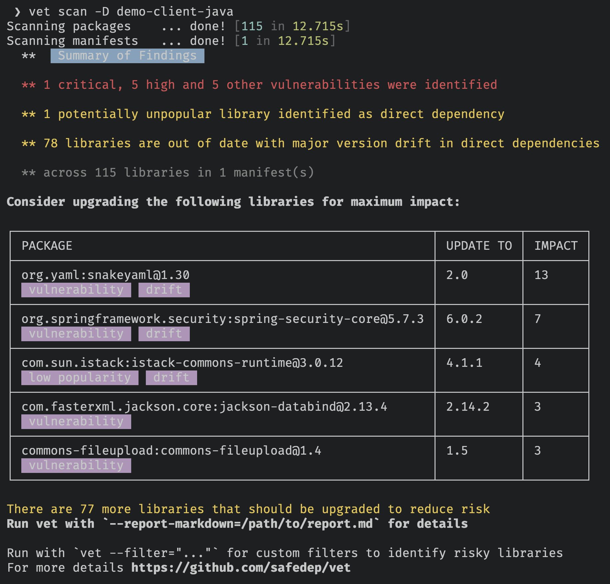
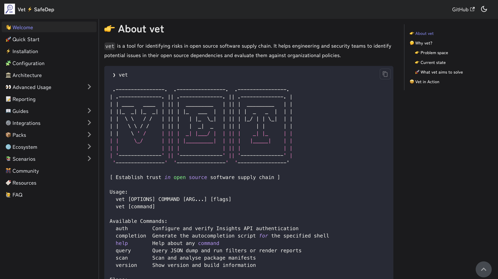
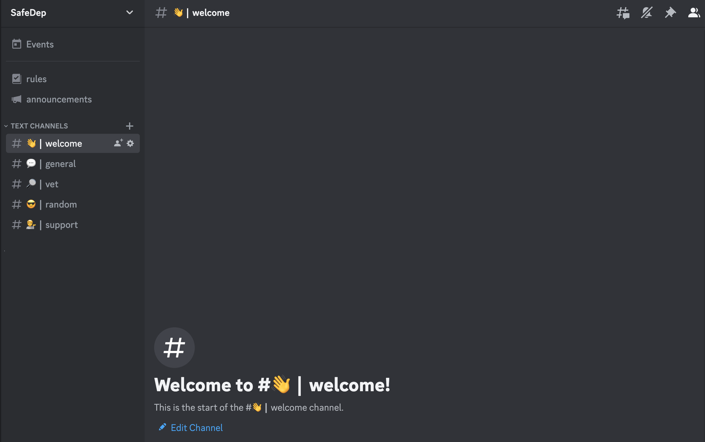

<h1 align="center">
    
    
</h1>

<p align="center">
    Created and maintained by <b><a href="https://safedep.io/">https://safedep.io</a></b> with contributions from the community 🚀
</p>

[](https://goreportcard.com/report/github.com/safedep/vet)


[](https://api.securityscorecards.dev/projects/github.com/safedep/vet)
[](https://github.com/safedep/vet/actions/workflows/codeql.yml)
[](https://slsa.dev)
[](https://github.com/safedep/vet/actions/workflows/scorecard.yml)
[](https://twitter.com/intent/follow?screen_name=safedepio)

# 🔍 vet

`vet` is a tool for **protecting against open source software supply chain attacks**. To adapt to organizational needs, it uses
an opinionated policy expressed as [Common Expressions Language](https://cel.dev/) and extensive
package security metadata including

- **Code Analysis** to guard against risks that actually matter
- **Vulnerabilities** from [OSV](https://osv.dev)
- **Popularity** based guardrails to prevent unvetted or risky packages
- **Maintenance** status of the package
- **Extended License Attributes** based compliance
- **OpenSSF Scorecard** based 3rd party OSS risk management
- **Direct** and **Transitive** dependency analysis for coverage

## 🐞 Malicious Code Analysis

`vet` is integrated with [SafeDep Cloud](https://docs.safedep.io/cloud/malware-analysis) for real time protection against
malicious open source packages through active code scanning and analysis. [vet-action](https://github.com/safedep/vet-action)
seamlessly integrates `vet` in GitHub Action for proactive guardrails against malicious code from open sources.

## 🎯 Policy as Code

`vet` is built for users who intend to enforce guardrails against open source supply chain attacks using their opinionated
policies. Security guardrails can be built by expressing policies as [CEL](https://cel.dev/) which `vet` enforces in CI/CD.


## 🔥 vet in action


# 🚀 Let's go!

- [🔍 vet](#-vet)
  - [🐞 Malicious Code Analysis](#-malicious-code-analysis)
  - [🎯 Policy as Code](#-policy-as-code)
  - [🔥 vet in action](#-vet-in-action)
- [🚀 Let's go!](#-lets-go)
  - [Getting Started](#getting-started)
    - [Running Scan](#running-scan)
      - [Scanning Binary Artifacts](#scanning-binary-artifacts)
      - [Scanning SBOM](#scanning-sbom)
      - [Scanning Github Repositories](#scanning-github-repositories)
      - [Scanning Github Organization](#scanning-github-organization)
      - [Scanning Package URL](#scanning-package-url)
      - [Available Parsers](#available-parsers)
  - [Policy as Code](#policy-as-code)
    - [Vulnerability](#vulnerability)
    - [License](#license)
    - [Scorecard](#scorecard)
  - [Query Mode](#query-mode)
  - [Reporting](#reporting)
  - [CI/CD Integration](#cicd-integration)
    - [📦 GitHub Action](#-github-action)
    - [🚀 GitLab CI](#-gitlab-ci)
  - [🐙 Malicious Package Analysis](#-malicious-package-analysis)
    - [🔍 Scanning Visual Studio Code Extensions](#-scanning-visual-studio-code-extensions)
    - [🔍 Scanning GitHub Actions (or any other GitHub repository)](#-scanning-github-actions-or-any-other-github-repository)
    - [🔍 Malicious Package Query](#-malicious-package-query)
  - [🛠️ Advanced Usage](#️-advanced-usage)
  - [📖 Documentation](#-documentation)
  - [Telemetry](#telemetry)
  - [🎊 Community](#-community)
  - [💻 Development](#-development)
  - [Support](#support)
  - [Star History](#star-history)
  - [🔖 References](#-references)

## Getting Started

- Download the binary file for your operating system / architecture from the [Official GitHub Releases](https://github.com/safedep/vet/releases)

- You can also install `vet` using homebrew in MacOS and Linux

```bash
brew tap safedep/tap
brew install safedep/tap/vet
```

- Alternatively, build from source

> Ensure $(go env GOPATH)/bin is in your $PATH

```bash
go install github.com/safedep/vet@latest
```

- Also available as a container image

```bash
docker run --rm -it ghcr.io/safedep/vet:latest version
```

> **Note:** Container image is built for x86_64 Linux only. Use a
> [pre-built binary](https://github.com/safedep/vet/releases) or
> build from source for other platforms.

### Running Scan

- Run `vet` to identify risks by scanning a directory

```bash
vet scan -D /path/to/repository
```



- Run `vet` to scan specific (supported) package manifests

```bash
vet scan -M /path/to/pom.xml
vet scan -M /path/to/requirements.txt
vet scan -M /path/to/package-lock.json
```

**Note:** `--lockfiles` is generalized to `-M` or `--manifests` to support additional
types of package manifests or other artifacts in future.

#### Scanning Binary Artifacts

- Scan a Java JAR file

```bash
vet scan -M /path/to/app.jar
```

> Suitable for scanning bootable JARs with embedded dependencies

- Scan a directory with JAR files

```bash
vet scan -D /path/to/jars --type jar
```

#### Scanning SBOM

- Scan an SBOM in [CycloneDX](https://cyclonedx.org/) format

```bash
vet scan -M /path/to/cyclonedx-sbom.json --type bom-cyclonedx
```

- Scan an SBOM in [SPDX](https://spdx.dev/) format

```bash
vet scan -M /path/to/spdx-sbom.json --type bom-spdx
```

**Note:** `--type` is a generalized version of `--lockfile-as` to support additional
artifact types in future.

> **Note:** SBOM scanning feature is currently in experimental stage

#### Scanning Github Repositories

- Setup github access token to scan private repo

```bash
vet connect github
```

Alternatively, set `GITHUB_TOKEN` environment variable with [Github PAT](https://docs.github.com/en/authentication/keeping-your-account-and-data-secure/managing-your-personal-access-tokens)

- To scan remote Github repositories, including private ones

```bash
vet scan --github https://github.com/safedep/vet
```

**Note:** You may need to enable [Dependency Graph](https://docs.github.com/en/code-security/supply-chain-security/understanding-your-software-supply-chain/about-the-dependency-graph) at repository or organization level for Github repository scanning to work.

#### Scanning Github Organization

> You must setup the required access for scanning private repositories
> before scanning organizations

```bash
vet scan --github-org https://github.com/safedep
```

> **Note:** `vet` will block and wait if it encounters Github secondary rate limit.

#### Scanning Package URL

- To scan a [purl](https://github.com/package-url/purl-spec)

```bash
vet scan --purl pkg:/gem/nokogiri@1.10.4
```

#### Available Parsers

- List supported package manifest parsers including experimental modules

```bash
vet scan parsers --experimental
```

## Policy as Code

`vet` uses [Common Expressions Language](https://github.com/google/cel-spec)
(CEL) as the policy language. Policies can be defined to build guardrails
preventing introduction of insecure components.

### Vulnerability

- Run `vet` and fail if a critical or high vulnerability was detected

```bash
vet scan -D /path/to/code \
    --filter 'vulns.critical.exists(p, true) || vulns.high.exists(p, true)' \
    --filter-fail
```

### License

- Run `vet` and fail if a package with a specific license was detected

```bash
vet scan -D /path/to/code \
    --filter 'licenses.exists(p, "GPL-2.0")' \
    --filter-fail
```

**Note:** Using `licenses.contains_license(...)` is recommended for license matching due
to its support for SPDX expressions.

- `vet` supports [SPDX License Expressions](https://spdx.github.io/spdx-spec/v2.3/SPDX-license-expressions/) at package license and policy level

```bash
vet scan -D /path/to/code \
    --filter 'licenses.contains_license("LGPL-2.1+")' \
    --filter-fail
```

### Scorecard

- Run `vet` and fail based on [OpenSSF Scorecard](https://securityscorecards.dev/) attributes

```bash
vet scan -D /path/to/code \
    --filter 'scorecard.scores.Maintained == 0' \
    --filter-fail
```

For more examples, refer to [documentation](https://docs.safedep.io/advanced/policy-as-code)

## Query Mode

- Run scan and dump internal data structures to a file for further querying

```bash
vet scan -D /path/to/code --json-dump-dir /path/to/dump
```

- Filter results using `query` command

```bash
vet query --from /path/to/dump \
    --filter 'vulns.critical.exists(p, true) || vulns.high.exists(p, true)'
```

- Generate report from dumped data

```bash
vet query --from /path/to/dump --report-json /path/to/report.json
```

## Reporting

`vet` supports generating reports in multiple formats during `scan` or `query`
execution.

| Format   | Description                                                                    |
|----------|--------------------------------------------------------------------------------|
| Markdown | Human readable report for vulnerabilities, licenses, and more                  |
| CSV      | Export data to CSV format for manual slicing and dicing                        |
| JSON     | Machine readable JSON format following internal schema (maximum data)          |
| SARIF    | Useful for integration with Github Code Scanning and other tools               |
| Graph    | Dependency graph in DOT format for risk and package relationship visualization |
| Summary  | Default console report with summary of vulnerabilities, licenses, and more     |

## CI/CD Integration

### 📦 GitHub Action

- `vet` is available as a GitHub Action, refer to [vet-action](https://github.com/safedep/vet-action)

### 🚀 GitLab CI

- `vet` can be integrated with GitLab CI, refer to [vet CI Component](https://gitlab.com/explore/catalog/safedep/ci-components/vet)

## 🐙 Malicious Package Analysis

`vet` supports scanning for malicious packages using [SafeDep Cloud API](https://docs.safedep.io/cloud/malware-analysis)
which requires an API key.

- To setup an API key for malicious package scanning

```bash
vet cloud quickstart
```

- Run a scan and check for malicious packages

```bash
vet scan -D /path/to/code --malware
```

**Note**: `vet` will submit identified packages to SafeDep Cloud for analysis and wait
for a `timeout` period for response. Not all package analysis may be completed
within the timeout period. However, subsequent scans will fetch the results if
available and lead to increased coverage over time. Adjust the timeout using
`--malware-analysis-timeout` flag.

### 🔍 Scanning Visual Studio Code Extensions

- Auto-discover and scan Visual Studio Code extensions in the local system

```bash
vet scan --vsx --malware
```

### 🔍 Scanning GitHub Actions (or any other GitHub repository)

- Scan a single GitHub Actions workflow using `inspect` command

```bash
vet inspect malware --purl pkg:github/safedep/vet-action@v1
```

- The same convention can be used to inspect any GitHub repository reference

```bash
vet inspect malware --purl pkg:github/safedep/vet@v1.9.5
```

- Scan all GitHub Actions workflows in a repository

```bash
vet scan -D .github/workflows --malware
```

**Note:** `vet` will resolve the commit hash for the given version and use it for malware analysis.
This is because GitHub repository tags are mutable and can be changed.

### 🔍 Malicious Package Query

If active analysis is not enabled using `vet scan --malware` flag, `vet` will fallback to query known
malicious packages data from community instance of [Malysis service](https://docs.safedep.io/cloud/malware-analysis).

## 🛠️ Advanced Usage

- [Threat Hunting with vet](https://docs.safedep.io/advanced/filtering)
- [Policy as Code](https://docs.safedep.io/advanced/policy-as-code)
- [Exceptions and Overrides](https://docs.safedep.io/advanced/exceptions)

## 📖 Documentation

- Refer to [https://safedep.io/docs](https://safedep.io/docs) for the detailed documentation

[](https://safedep.io/docs)

## Telemetry

`vet` collects anonymous telemetry to help us understand how it is used and
improve the product. To disable telemetry, set `VET_DISABLE_TELEMETRY` environment
variable to `true`.

```bash
export VET_DISABLE_TELEMETRY=true
```

## 🎊 Community

First of all, thank you so much for showing interest in `vet`, we appreciate it ❤️

- Join the Discord server using the link - [https://rebrand.ly/safedep-community](https://rebrand.ly/safedep-community)

[](https://rebrand.ly/safedep-community)

## 💻 Development

Refer to [CONTRIBUTING.md](CONTRIBUTING.md)

## Support

[SafeDep](https://safedep.io) provides enterprise support for `vet`
deployments. Check out [SafeDep Cloud](https://safedep.io) for large scale
deployment and management of `vet` in your organization.

## Star History

[](https://star-history.com/#safedep/vet&Date)

## 🔖 References

- https://github.com/google/osv-scanner
- https://github.com/anchore/syft
- https://deps.dev/
- https://securityscorecards.dev/
- https://slsa.dev/


