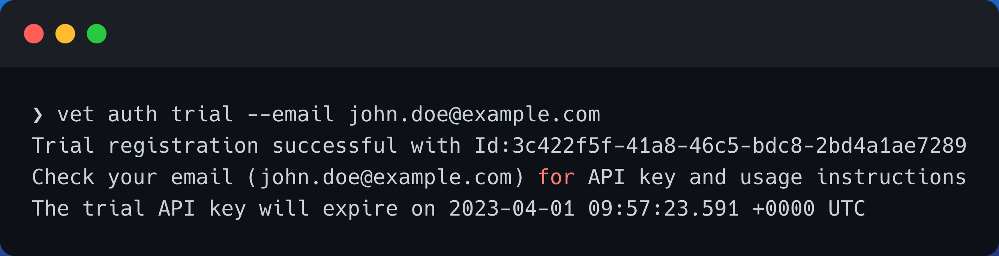
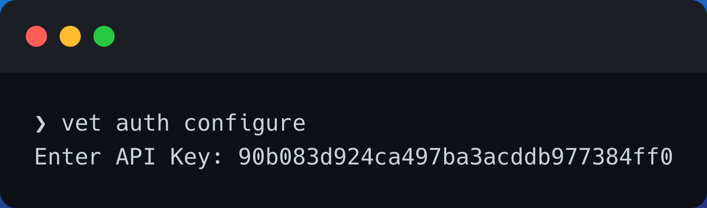

<h1 align="center">
    
</h1>
<p align="center">
    🙌 Refer to <b><a href="https://safedep.io/docs/">https://safedep.io/docs</a></b> for the documentation 📖
</p>

[](https://goreportcard.com/report/github.com/safedep/vet)


[](https://api.securityscorecards.dev/projects/github.com/safedep/vet)
[](https://github.com/safedep/vet/actions/workflows/codeql.yml)
[](https://slsa.dev)
[](https://github.com/safedep/vet/actions/workflows/scorecard.yml)
[](https://twitter.com/intent/follow?screen_name=safedepio)

[](https://safedep.io/docs)
## Automate Open Source Package Vetting in CI/CD

`vet` is a tool for identifying risks in open source software supply chain. It
helps engineering and security teams to identify potential issues in their open
source dependencies and evaluate them against organizational policies.

## 🔥 vet in action


## Getting Started

- Download the binary file for your operating system / architecture from the [Official GitHub Releases](https://github.com/safedep/vet/releases)

- You can also install `vet` using homebrew in MacOS and Linux

```bash
brew tap safedep/tap
brew install safedep/tap/vet
```

- Alternatively, build from source

> Ensure $(go env GOPATH)/bin is in your $PATH

```bash
go install github.com/safedep/vet@latest
```

- Get an API key for the vet insights data access for performing the scan.
    Alternatively, look at [using community endpoint without API key](#using-community-mode)

```bash
vet auth trial --email john.doe@example.com
```



> A time limited trial API key will be sent over email.

- Configure `vet` to use API key to access the insights

```bash
vet auth configure
```



> Insights API is used to enrich OSS packages with metadata for rich query and policy decisions. Alternatively, the API key can be passed through environment variable `VET_API_KEY`

- You can verify the configured key is successful by running the following command

```bash
vet auth verify
```

### Using Community Mode

Community mode can be used to avoid registering and obtaining an API key.

```bash
vet auth configure --community
```

### Running Scan

- Run `vet` to identify risks

```bash
vet scan -D /path/to/repository
```


- You can also scan a specific (supported) package manifest

```bash
vet scan --lockfiles /path/to/pom.xml
vet scan --lockfiles /path/to/requirements.txt
vet scan --lockfiles /path/to/package-lock.json
```

> [Example Security Gate](https://github.com/safedep/demo-client-java/pull/2) using `vet` to prevent introducing new OSS dependency risk in an application.

#### Scanning SBOM

- To scan an SBOM in [CycloneDX](https://cyclonedx.org/) format

```bash
vet scan --lockfiles /path/to/cyclonedx-sbom.json --lockfile-as bom-cyclonedx
```

> **Note:** SBOM scanning feature is currently in experimental stage

#### Available Parsers

- To list supported package manifest parsers including experimental modules

```bash
vet scan parsers --experimental
```

## 📖 Documentation

- Refer to [https://safedep.io/docs](https://safedep.io/docs) for the detailed documentation

[](https://safedep.io/docs)

## 🎊 Community

First of all, thank you so much for showing interest in `vet`, we appreciate it ❤️

- Join the server using the link - [https://rebrand.ly/safedep-community](https://rebrand.ly/safedep-community)

[](https://rebrand.ly/safedep-community)

## 🔖 References

- [https://github.com/google/osv-scanner](https://github.com/google/osv-scanner)
