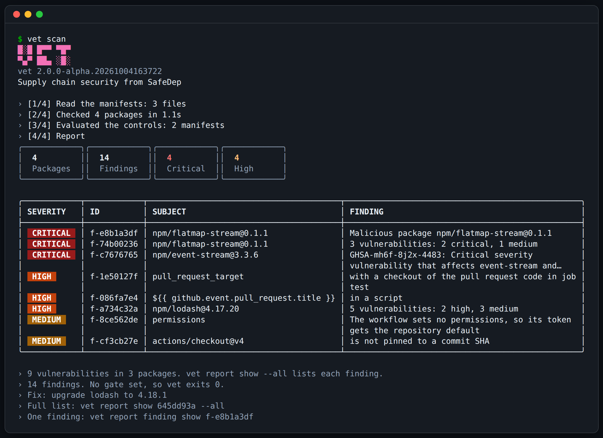

<p align="center">
  <a href="https://safedep.io">
    <picture>
      <source srcset="docs/assets/vet-banner-dark.svg" media="(prefers-color-scheme: dark)">
      <source srcset="docs/assets/vet-banner-light.svg" media="(prefers-color-scheme: light)">
      
    </picture>
  </a>
</p>

<p align="center">
  <strong>Find malicious packages, vulnerabilities and risky CI workflows before they reach production.</strong>
</p>

<div align="center">

[](https://github.com/safedep/vet/releases)
[](https://github.com/safedep/vet/actions/workflows/release-edge.yml)
[](https://scorecard.dev/viewer/?uri=github.com/safedep/vet)
[](LICENSE)
[](https://discord.gg/kAGEj25dCn)

[Install](docs/install.md) • [Docs](docs/README.md) • [Commands](docs/cmd/README.md) • [Policy](docs/policy.md) • [Discord](https://discord.gg/kAGEj25dCn)

</div>

> [!NOTE]
> This branch is vet v2, in alpha. vet v1 is on [`main`](https://github.com/safedep/vet/tree/main)
> and stays the latest release. The [v2.0.0 release notes](docs/release-notes/v2.0.0.md) map each
> v1 command and flag to v2.

## Why vet

Your dependencies, your GitHub Actions workflows and your AI agent configs run code that you did
not write. vet finds the risk in them.

- **Malicious packages.** vet checks each package against SafeDep Threat Intel. Threat Intel
  analyzes new package versions when the registries publish them.
- **Known vulnerabilities**, with the fixed version to upgrade to.
- **Risky workflows.** Dangerous triggers, template injection, exposed secrets and actions with no
  pinned commit SHA.
- **Lockfile tampering and fresh versions.** Entries from an untrusted registry, and versions
  inside the cooldown window.
- **Policy as code.** Rules in CEL decide when a scan fails. You can test a rule on a saved scan.
- **AI and crypto inventory.** vet lists the AI libraries and the crypto algorithms that your code
  calls, and writes a CycloneDX xBOM and CBOM.

vet needs no account and sends no source code.

## Quick start

```bash
brew install --cask safedep/tap/vet@edge
vet scan
```

<p align="center">
  
</p>

```bash
vet scan --fail-on high                         # exit 1 on a high or critical finding
vet scan --base-ref origin/main --fail-on high  # report only what a pull request changes
vet report show --report sarif=vet.sarif        # write SARIF from the saved scan, with no new scan
```

## Install

| Channel | Command |
| --- | --- |
| Homebrew | `brew install --cask safedep/tap/vet@edge` |
| mise | `mise use -g 'github:safedep/vet[prerelease=true]@2'` |
| Go | `go install github.com/safedep/vet/v2/cmd/vet@latest` |
| Container | `docker run --rm -v "$PWD:/src" -w /src ghcr.io/safedep/vet:v2-latest scan` |

mise installs a release one day after its publication. [install.md](docs/install.md) has the
command for the newest build, the release binaries and the build attestations.

## What vet scans

| Target | Example |
| --- | --- |
| A directory (the default) | `vet scan`, `vet scan ./service` |
| A git repository | `vet scan https://github.com/safedep/vet` |
| A container image | `vet scan oci://alpine:3.20`, `vet scan image.tar` |
| An SBOM (CycloneDX or SPDX) | `vet scan sbom.cdx.json` |
| One package | `vet scan pkg:npm/express@4.19.2` |
| The tools on this machine | `vet endpoint audit` |

vet reads the lockfiles and manifests of npm, PyPI, Go, Maven, Gradle, Cargo, RubyGems, NuGet,
Packagist, Pub and more. It also reads the GitHub Actions workflows and the AI agent configs of the
target. It does not install or run any of them. Controls turn this data into findings. See
[controls.md](docs/controls.md).

## Policy

A policy decides when a scan fails. Save this file as `vet-policy.yml`:

```yaml
version: 2
rules:
  - id: no-malware
    description: A malicious or suspicious package fails the build.
    when: finding.family == "malware"
    action: fail
  - id: no-workflow-injection
    when: finding.control_id in ["dangerous-trigger", "template-injection"]
    action: fail
  - id: no-critical-vulnerability
    when: finding.control_id == "vulnerability" && finding.severity == "critical"
    action: fail
  - id: new-dependency-age
    description: A pull request cannot add a version that is less than 14 days old.
    when: package.change == "ADDED" && has(package.days_since_publish) && package.days_since_publish < 14
    action: fail
suppressions:
  - purl: pkg:npm/lodash@4.17.20
    reason: The upgrade to 4.18.1 is in pull request 42.
    expires: 2026-12-31
```

Test it on the last scan, with no new scan. Then apply it to a pull request:

```bash
vet report show last --policy vet-policy.yml
vet scan --base-ref origin/main --policy vet-policy.yml
```

After its expiry date, the suppression no longer hides the finding. Read
[policy.md](docs/policy.md) for the rule fields, more rules and the
[Agent Skill](.claude/skills/vet-policy-authoring/SKILL.md) that writes a policy for you.

## Use cases

- **Pull request check.** The [vet GitHub Action](docs/github-action.md) comments on a pull
  request that adds a package, a workflow or a finding, and fails the check on an attack. `vet ci init` adds it to a repository.
- **CI gate.** Exit codes, SARIF for GitHub code scanning, GitLab and Bitbucket reports. See
  [ci.md](docs/ci.md).
- **Pull request review.** `--base-ref` reports only the packages and workflows that a change adds.
- **xBOM and CBOM.** A CycloneDX 1.7 inventory of the AI libraries and the crypto that your code
  uses. See [inventory.md](docs/inventory.md).
- **AI agents.** vet finds Claude Code and other agents, and then writes JSON and never prompts.
- **Endpoint audit.** `vet endpoint audit` lists the AI tools, MCP servers, editor extensions and
  global npm packages on a developer machine, and checks them for malware.

## Documentation

| Page | Read it for |
| --- | --- |
| [Install](docs/install.md) | All channels and how to verify a release |
| [Commands](docs/cmd/README.md) | Every command, its flags and its exit codes |
| [Controls](docs/controls.md) | The controls and their options |
| [Policy](docs/policy.md) | Rules, suppressions and the gate |
| [Output](docs/output.md) | Report formats, saved scans and configuration |
| [CI and AI agents](docs/ci.md) | GitHub Actions, GitLab, Bitbucket and agent mode |
| [Inventory](docs/inventory.md) | Code usage, AI and crypto, xBOM and CBOM |

## Privacy

vet sends the identity of each package (its ecosystem, name and version) to SafeDep to get the data
about it. vet sends no source code and no file content.

## Community

- Ask questions and share ideas on [Discord](https://discord.gg/kAGEj25dCn) or in
  [GitHub Discussions](https://github.com/safedep/vet/discussions).
- Report a bug in the [issue tracker](https://github.com/safedep/vet/issues).
- Read the [contributing guide](CONTRIBUTING.md) before you open a pull request.

vet also runs in the cloud. [SafeDep Cloud](https://safedep.io/) runs vet on your repositories, with
no infrastructure to manage.

<a href="https://github.com/safedep/vet/graphs/contributors">
  
</a>
