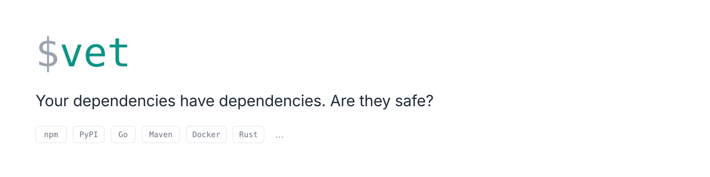

<p align="center">
  <a href="https://safedep.io">
    <picture>
      <source srcset="docs/assets/vet-banner-dark.svg" media="(prefers-color-scheme: dark)">
      <source srcset="docs/assets/vet-banner-light.svg" media="(prefers-color-scheme: light)">
      
    </picture>
  </a>
</p>

<div align="center">
  <p>
    <a href="#quick-start"><strong>Quick Start</strong></a> •
    <a href="https://docs.safedep.io/"><strong>Documentation</strong></a> •
    <a href="#community--support"><strong>Community</strong></a>
  </p>
</div>

<div align="center">

[](https://goreportcard.com/report/github.com/safedep/vet)
[](https://github.com/safedep/vet/blob/main/LICENSE)
[](https://github.com/safedep/vet/releases)
[](https://api.securityscorecards.dev/projects/github.com/safedep/vet)
[](https://slsa.dev)
[](https://github.com/safedep/vet/actions/workflows/codeql.yml)

[](https://deepwiki.com/safedep/vet)

</div>

---

> [!NOTE]
> `vet` also runs in the cloud. Point it at your GitHub repositories and get continuous scanning, malware detection, and policy enforcement without managing any infrastructure. See [SafeDep Cloud](https://safedep.io/) for the end-to-end software supply chain security platform.

## Why vet?

Your dependencies, your GitHub Actions workflows and your container images all run code that
you did not write. `vet` finds the supply chain risk in them before it reaches production.

- **Malicious packages.** vet checks each package against [SafeDep Malysis](https://safedep.io/),
  which analyzes new package versions as the registries publish them.
- **Known vulnerabilities**, with data from SafeDep Insights.
- **Risky workflows.** Dangerous triggers, template injection and actions with no pinned commit SHA.
- **Lockfile tampering.** Entries from an untrusted registry, or with the URL of another package.
- **Fresh versions.** A version inside the cooldown window, before the community had time to look.

A plain scan reports and exits 0. A gate (`--fail-on`, or a policy) makes the scan exit 1 when
it fails, so the same command works on a laptop, in CI and for an AI agent.

## Quick Start

```bash
# Install
brew install safedep/tap/vet

# Scan the current directory
vet scan

# Fail CI on a high or critical finding
vet scan --fail-on high

# Report only what a pull request changes
vet scan --base-ref origin/main --fail-on high

# Write SARIF for GitHub code scanning, from the saved scan, with no new scan
vet report show --report sarif=vet.sarif
```

vet needs no account. With no credentials, vet uses the community endpoints of SafeDep. Run
`vet auth login` to use the API endpoints of your SafeDep Cloud tenant.

## What vet scans

| Target | Example |
| --- | --- |
| A directory (the default) | `vet scan`, `vet scan ./service` |
| A git repository | `vet scan https://github.com/safedep/vet` |
| A container image | `vet scan oci://alpine:3.20`, `vet scan image.tar` |
| An SBOM (CycloneDX or SPDX) | `vet scan sbom.cdx.json` |
| One package | `vet scan pkg:npm/express@4.19.2` |

vet reads the lockfiles and manifests of npm, PyPI, Go, Maven, Gradle, Cargo, RubyGems, NuGet,
Packagist, Pub and more, and the GitHub Actions workflows of the target. It does not install or
run any of them.

## Controls

A control turns the data about a package or a workflow into findings. `vet policy control list`
prints them.

| Control | Family | Default severity | Finds |
| --- | --- | --- | --- |
| `malware` | malware | critical | A malicious package |
| `suspicious-package` | malware | high | A package that the analysis marks suspicious |
| `vulnerability` | vulnerability | from the advisory | A known vulnerability |
| `dependency-cooldown` | cooldown | high | A version that the registry published in the cooldown window (5 days) |
| `untrusted-registry` | lockfile | high | A lockfile entry (npm, yarn, pnpm, bun, uv, Cargo) from an untrusted registry |
| `registry-path-mismatch` | lockfile | high | A lockfile entry with the URL of another package |
| `integrity-changed` | lockfile | high | In pull request mode, a lockfile entry whose hash changes with no version change |
| `lockfile-only-change` | lockfile | high | In pull request mode, a lockfile change with no change to the manifest file next to it |
| `install-scripts-added` | hygiene | high | In pull request mode, a new or upgraded npm package that runs install scripts |
| `provenance-lost` | hygiene | medium | An upgrade to a version with no SLSA provenance, when the previous version had one |
| `deprecated-package` | hygiene | medium | A version that the registry marks deprecated |
| `license-change` | license | medium | An upgrade that changes the license |
| `non-registry-dependency` | hygiene | medium | A dependency on git, a URL, a file or any version |
| `scorecard-low` | hygiene | info | A package whose repository has an OpenSSF Scorecard score under 3 |
| `typosquat` | reputation | high | A name one typo away from a popular package, with few downloads |
| `new-unpopular-package` | reputation | medium | A package whose first version is under 30 days old, with under 1000 downloads |
| `version-anomaly` | reputation | medium | An upgrade that jumps two major versions, or to a version older than the previous one |
| `starjacking` | reputation | medium | A package that claims a popular repository and has almost no downloads |
| `dependency-confusion` | reputation | medium | A package that matches `internal_names` and comes from a public registry |
| `ai-bom-delta` | ai-bom | medium | In pull request mode, a new LLM SDK, agent framework or MCP library |
| `dangerous-trigger` | workflow | high | A `pull_request_target` or `workflow_run` workflow that checks out untrusted code |
| `template-injection` | workflow | high | An untrusted expression inside a `run:` script |
| `unpinned-action` | workflow | medium | A third-party action that a tag or a branch selects |
| `excessive-permissions` | workflow | medium | A workflow with no permissions or with write-all |
| `secrets-exposure` | workflow | high | `secrets: inherit`, `toJSON(secrets)` or a secret in a script |
| `github-env-injection` | workflow | high | A write to `GITHUB_ENV` or `GITHUB_PATH` with input that an outside user controls |
| `cache-poisoning` | workflow | medium | A cache in a release or deploy job |
| `artifact-poisoning` | workflow | medium | An artifact download in a `workflow_run` workflow |
| `self-hosted-runner` | workflow | medium | A job on a self-hosted runner |
| `spoofable-bot-condition` | workflow | medium | A condition on the actor name of a bot |
| `editor-task-command` | agent-config | medium, high on folder open | A `.vscode/tasks.json` task that runs a shell command |
| `agent-hook-command` | agent-config | medium | A Claude Code hook, a devcontainer lifecycle command or a git hook |
| `mcp-server-added` | agent-config | medium | An MCP server in an agent or editor config |
| `agent-instruction-change` | agent-config | info | An agent instruction file such as `CLAUDE.md` or `.cursorrules` |
| `suspicious-command` | agent-config | critical | A command in those files that runs a downloaded script, decodes a payload or reads credentials |

`vet fix github-actions run` pins each third-party action to its commit SHA.

With `plugins.codeusage.enabled: true`, a scan of a directory also reads the source files and
records which packages the code imports. Each package finding then says whether the project
imports the package, and in which files. The code analysis needs a vet build with CGO, such as
`go install`. A static release build records a diagnostic and scans with no code usage.

## Policy

A policy file sets the rules of the gate and the suppressions. A rule is a
[CEL](https://cel.dev/) condition over the finding, the package and the manifest.

```yaml
version: 2
rules:
  - id: no-malware
    when: finding.family == "malware"
    action: fail
  - id: fresh-packages
    when: package.days_since_publish < 5
    action: warn
suppressions:
  - purl: pkg:npm/left-pad@1.3.0
    control: dependency-cooldown
    reason: Reviewed. The maintainer published a fix.
    expires: 2026-12-31
```

```bash
vet policy init            # write a starter policy
vet policy validate        # check it
vet scan --policy vet-policy.yml
```

`vet policy schema get` prints the fields that a rule can read.

## Output

The terminal view goes to stderr. Report data goes to stdout with `-o`, and to files with
`--report FORMAT=PATH`. One scan writes many formats.

| Format | Use |
| --- | --- |
| `table`, `plain` | People, and `grep` |
| `json`, `jsonl` | Programs. `vet report schema get` prints the JSON Schema |
| `sarif` | GitHub code scanning and other SARIF tools |
| `markdown` | A pull request comment or a job summary |
| `cyclonedx` | An SBOM with the findings as vulnerabilities |

vet saves each scan in its state directory. `vet report show`, `vet report list`,
`vet report diff` and `vet report finding show` read the saved scans with no new scan. A scan
that stops (Ctrl-C, a lost connection) continues on the next run.

## CI and AI agents

| Exit code | Meaning |
| --- | --- |
| 0 | The scan completed, and the gate passed or no gate was set |
| 1 | The gate failed |
| 2 | A usage or config error. The message names the fix |
| 3 | A runtime error, for example a report file that vet cannot write |
| 130 | A signal stopped vet. The scan continues on the next run |

vet finds an AI agent from `CLAUDECODE` or `AI_AGENT`, and then writes JSON on stdout, never
prompts, and prints each error as one `ERR: code=… message=… help=…` line. `--mode agent` sets
the same behavior.

Coming from v1? The [v2.0.0 release notes](docs/release-notes/v2.0.0.md) map each v1 command,
flag, variable and report field to v2.

## Command reference

vet v2 has one page for each command under [docs/cmd](docs/cmd). The table lists every command in
the order of the command tree.

| Command | Description |
| --- | --- |
| [`vet auth login`](docs/cmd/auth-login.md) | Save an API key in the keychain profile. |
| [`vet auth status`](docs/cmd/auth-status.md) | Show the credentials that vet uses. |
| [`vet auth logout`](docs/cmd/auth-logout.md) | Delete the credentials of the keychain profile. |
| [`vet config show`](docs/cmd/config-show.md) | Show the effective config. |
| [`vet config get`](docs/cmd/config-get.md) | Print one config value. |
| [`vet config set`](docs/cmd/config-set.md) | Set a key in the user config file. |
| [`vet config delete`](docs/cmd/config-delete.md) | Remove a key from the user config file. |
| [`vet config edit`](docs/cmd/config-edit.md) | Open the user config file in an editor. |
| [`vet config validate`](docs/cmd/config-validate.md) | Check a config file. |
| [`vet config schema get`](docs/cmd/config-schema-get.md) | Print the JSON Schema of the config file. |
| [`vet doctor`](docs/cmd/doctor.md) | Check the state, the config, the credentials and the endpoints. |
| [`vet scan`](docs/cmd/scan.md) | Scan a project, a repository, an image, an SBOM or a package. |
| [`vet report show`](docs/cmd/report-show.md) | Render a saved report. |
| [`vet report list`](docs/cmd/report-list.md) | List the saved scans of the current directory. |
| [`vet report diff`](docs/cmd/report-diff.md) | Compare the findings of two saved scans. |
| [`vet report finding show`](docs/cmd/report-finding-show.md) | Show one finding of a saved scan. |
| [`vet report schema get`](docs/cmd/report-schema-get.md) | Print the JSON Schema of the report. |
| [`vet policy init`](docs/cmd/policy-init.md) | Write a starter policy file. |
| [`vet policy validate`](docs/cmd/policy-validate.md) | Check a policy file. |
| [`vet policy control list`](docs/cmd/policy-control-list.md) | List the controls and their default severities. |
| [`vet policy schema get`](docs/cmd/policy-schema-get.md) | Print the JSON Schema of the rule input. |
| [`vet fix github-actions run`](docs/cmd/fix-github-actions-run.md) | Pin third-party GitHub Actions to commit SHAs. |
| [`vet endpoint audit`](docs/cmd/endpoint-audit.md) | Audit the tools on this machine. |
| [`vet state show`](docs/cmd/state-show.md) | Show the state and cache directories, the scans and the retention rules. |
| [`vet state delete`](docs/cmd/state-delete.md) | Delete scans or the enrichment cache. |
| [`vet version`](docs/cmd/version.md) | Show the version and the build of vet. |

## Installation

### Homebrew

```bash
brew install safedep/tap/vet
```

### Release binaries

Download the binary for your platform from the
[releases page](https://github.com/safedep/vet/releases).

### Go

```bash
go install github.com/safedep/vet/v2/cmd/vet@latest
```

### Check the install

```bash
vet version
vet doctor
```

## Configuration

vet reads `vet.yml` from the user config directory (`vet config show` prints the path and each
value with its source), then the `VET_*` variables, then the flags. A config file inside the
scanned target changes nothing. `vet config schema get` prints the JSON Schema of the file.

## Privacy

vet sends the identity of each package (its ecosystem, name and version) to SafeDep to get the
data about it. vet sends no source code and no file content.

## Community & Support

<div align="center">

### Join the Community

[](https://rebrand.ly/safedep-community)
[](https://github.com/safedep/vet/discussions)
[](https://twitter.com/safedepio)

</div>

### Get Help & Share Ideas

- **[Interactive Tutorial](https://killercoda.com/safedep/scenario/101-intro)** - Learn vet hands-on
- **[Complete Documentation](https://docs.safedep.io/)** - Comprehensive guides
- **[Discord Community](https://rebrand.ly/safedep-community)** - Real-time support
- **[Issue Tracker](https://github.com/safedep/vet/issues)** - Bug reports & feature requests
- **[Contributing Guide](CONTRIBUTING.md)** - Join the development

---

<div align="center">

### Built With Open Source

vet stands on the shoulders of giants:

[OSV](https://osv.dev) • [OpenSSF Scorecard](https://securityscorecards.dev/) • [SLSA](https://slsa.dev/) • [OSV-SCALIBR](https://github.com/google/osv-scalibr)

### Contributors

Thank you to all contributors ❤️

<a href="https://github.com/safedep/vet/graphs/contributors">
  
</a>

---

<p><strong>Secure your supply chain today. Star the repo and get started!</strong></p>

Created with love by [SafeDep](https://safedep.io) and the open source community

</div>


