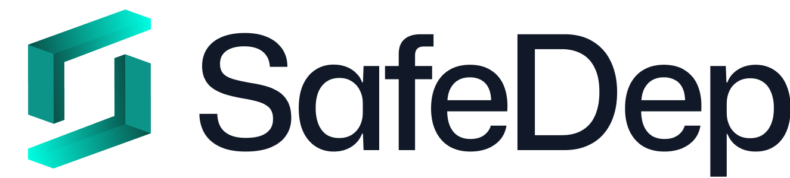

<div align="center">
  

  <h1>SafeDep VET</h1>
  
  <p><strong>🛡️ Real-time malicious package detection & software supply chain security</strong></p>
  
  <p>
    <a href="#-quick-start"><strong>Quick Start</strong></a> •
    <a href="https://docs.safedep.io/"><strong>Documentation</strong></a> •
    <a href="#-community"><strong>Community</strong></a>
  </p>
</div>

<div align="center">

[](https://goreportcard.com/report/github.com/safedep/vet)
[](https://github.com/safedep/vet/blob/main/LICENSE)
[](https://github.com/safedep/vet/releases)
[](https://api.securityscorecards.dev/projects/github.com/safedep/vet)
[](https://slsa.dev)
[](https://github.com/safedep/vet/actions/workflows/codeql.yml)

[](https://deepwiki.com/safedep/vet)


</div>

---

## 🎯 Why vet?

> **70-90% of modern software constitute code from open sources** — How do we know if it's safe?

**vet** is an open source software supply chain security tool built for **developers and security engineers** who need:

✅ **Real-time malicious package detection** — Active scanning and analysis of unknown packages  
✅ **Modern SCA with actual usage analysis** — Prioritize real risks over vulnerability noise  
✅ **Policy as Code** — Express security requirements using [CEL](https://cel.dev/) expressions  

Hosted SaaS version available at [SafeDep Cloud](https://app.safedep.io). 
Get started with [GitHub App](https://github.com/apps/safedep) and other integrations.

## ⚡ Quick Start

**Install in seconds:**

```bash
# macOS & Linux
brew install safedep/tap/vet
```

or download a [pre-built binary](https://github.com/safedep/vet/releases)

**Get started immediately:**

```bash
# Scan for malware in your dependencies
vet scan -D . --malware-query

# Fail CI on critical vulnerabilities
vet scan -D . --filter 'vulns.critical.exists(p, true)' --filter-fail

# Get API key for advanced malware detection
vet cloud quickstart
```

## 📦 Architecture


## 🔒 Key Features

### 🛡️ **Malicious Package Detection**

Real-time protection against malicious packages powered by [SafeDep Cloud](https://docs.safedep.io/cloud/malware-analysis). 
Free for open source projects. Detects zero-day malware through active code analysis.

### 🕵️ **Smart Vulnerability Analysis**

Unlike dependency scanners that flood you with noise, `vet` analyzes your **actual code usage** to prioritize real risks. 
See [dependency usage evidence](https://docs.safedep.io/vet/guides/dependency-usage-identification) for details.

### 📋 **Policy as Code**

Define security policies using CEL expressions to enforce context-specific requirements:

```bash
# Block packages with critical CVEs
vet scan --filter 'vulns.critical.exists(p, true)' --filter-fail

# Enforce license compliance
vet scan --filter 'licenses.contains_license("GPL-3.0")' --filter-fail

# Require minimum OpenSSF Scorecard scores
vet scan --filter 'scorecard.scores.Maintained < 5' --filter-fail
```

### 🎯 **Multi-Ecosystem Support**

Package managers: **npm**, **PyPI**, **Maven**, **Go**, **Ruby**, **Rust**, **PHP**  
Container images: **Docker**, **OCI**  
SBOM formats: **CycloneDX**, **SPDX**  
Source repositories: **GitHub**, **GitLab**

## 🛡️ Malicious Package Detection

**Real-time protection against malicious packages** with active scanning and behavioral analysis.

### 🚀 Quick Setup

```bash
# One-time setup for advanced scanning
vet cloud quickstart

# Scan for malware with active scanning (requires API key)
vet scan -D . --malware

# Query known malicious packages (no API key needed)
vet scan -D . --malware-query
```

**Example detections:**
- [MAL-2025-3541: express-cookie-parser](https://safedep.io/malicious-npm-package-express-cookie-parser/)
- [MAL-2025-4339: eslint-config-airbnb-compat](https://safedep.io/digging-into-dynamic-malware-analysis-signals/)
- [MAL-2025-4029: ts-runtime-compat-check](https://safedep.io/digging-into-dynamic-malware-analysis-signals/)

**Key security features:**
- ✅ Real-time analysis against known malware databases
- ✅ Behavioral analysis using static and dynamic analysis
- ✅ Zero-day protection through active code scanning
- ✅ Human-in-the-loop triaging for high-impact findings
- ✅ Public [analysis log](https://vetpkg.dev/mal) for transparency

### 🎯 Advanced Usage

```bash
# Specialized scans
vet scan --vsx --malware                    # VS Code extensions
vet scan -D .github/workflows --malware     # GitHub Actions
vet scan --image nats:2.10 --malware        # Container images

# Analyze specific packages
vet inspect malware --purl pkg:npm/nyc-config@10.0.0
```

## 🚀 Production Ready Integrations

### 📦 GitHub Actions

Zero-config security guardrails in CI/CD:

```yaml
- uses: safedep/vet-action@v1
  with:
    policy: ".github/vet/policy.yml"
```

See [vet-action](https://github.com/safedep/vet-action) documentation.

### 🔧 GitLab CI

Enterprise scanning with [vet CI Component](https://docs.safedep.io/vet/guides/gitlab-dependency-scanning):

```yaml
include:
  - component: gitlab.com/safedep/ci-components/vet/scan@main
```

### 🐳 Container Integration

Run `vet` anywhere using our container image:

```bash
docker run --rm -v $(pwd):/app ghcr.io/safedep/vet:latest scan -D /app --malware
```

## 📦 Installation

### 🍺 Homebrew (Recommended)

```bash
brew tap safedep/tap
brew install safedep/tap/vet
```

### 📥 Direct Download

See [releases](https://github.com/safedep/vet/releases) for pre-built binaries.

### 🐹 Go Install

```bash
go install github.com/safedep/vet@latest
```

### 🐳 Container Image

```bash
# Quick test
docker run --rm ghcr.io/safedep/vet:latest version

# Scan local directory
docker run --rm -v $(pwd):/workspace ghcr.io/safedep/vet:latest scan -D /workspace
```

### ⚙️ Verify Installation

```bash
vet version
# Should display version and build information
```

## 📚 Advanced Features

**Learn more in our comprehensive documentation:**

- **[MCP Server](./docs/mcp.md)** - Run vet as an MCP server for AI-assisted code analysis
- **[AI Agent Mode](./docs/agent.md)** - Run vet as an AI agent
- **[Reporting](https://docs.safedep.io/)** - SARIF, JSON, CSV, HTML, Markdown formats
- **[SBOM Support](https://docs.safedep.io/vet/guides/cyclonedx-sbom)** - CycloneDX, SPDX import/export
- **[Query Mode](https://docs.safedep.io/cloud/quickstart#query-your-data)** - Scan once, analyze multiple times
- **[GitHub Integration](https://docs.safedep.io/)** - Repository and organization scanning

## 📊 Privacy

`vet` collects anonymous usage telemetry to improve the product. **Your code and package information is never transmitted.**

```bash
# Disable telemetry (optional)
export VET_DISABLE_TELEMETRY=true
```

## 🎊 Community & Support

<div align="center">

### 🌟 Join the Community

[](https://rebrand.ly/safedep-community)
[](https://github.com/safedep/vet/discussions)
[](https://twitter.com/safedepio)

</div>

### 💡 Get Help & Share Ideas

- 🚀 **[Interactive Tutorial](https://killercoda.com/safedep/scenario/101-intro)** - Learn vet hands-on
- 📚 **[Complete Documentation](https://docs.safedep.io/)** - Comprehensive guides
- 💬 **[Discord Community](https://rebrand.ly/safedep-community)** - Real-time support
- 🐛 **[Issue Tracker](https://github.com/safedep/vet/issues)** - Bug reports & feature requests
- 🤝 **[Contributing Guide](CONTRIBUTING.md)** - Join the development

---

<div align="center">

### ⭐ Star History

[](https://star-history.com/#safedep/vet&Date)

### 🙏 Built With Open Source

vet stands on the shoulders of giants:

[OSV](https://osv.dev) • [OpenSSF Scorecard](https://securityscorecards.dev/) • [SLSA](https://slsa.dev/) • [OSV-SCALIBR](https://github.com/google/osv-scalibr) • [Syft](https://github.com/anchore/syft)

---

<p><strong>⚡ Secure your supply chain today. Star the repo ⭐ and get started!</strong></p>

Created with ❤️ by [SafeDep](https://safedep.io) and the open source community

</div>

