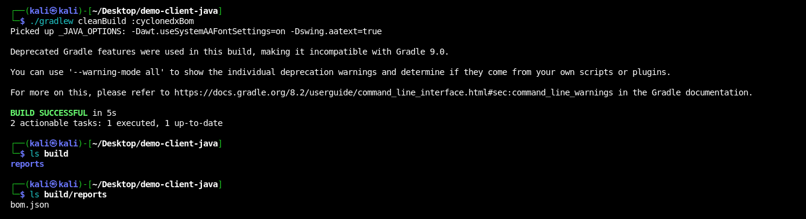
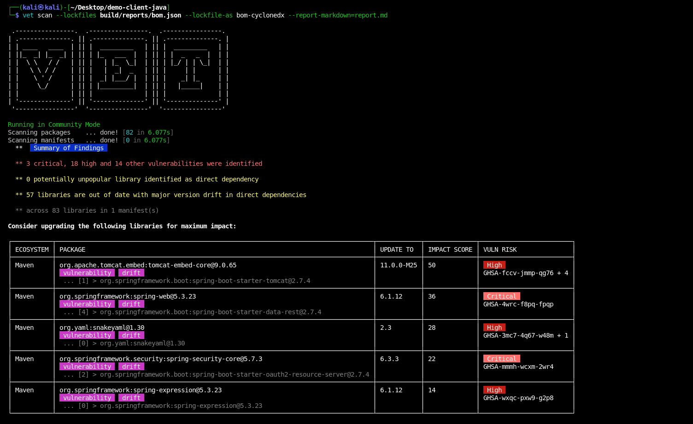

# Dependency Inventory

In this guide, we will use CycloneDX `gradle` plugin to generate a software
bill of material (SBOM) and scan it using `vet`.

## CycloneDX Plugin Integration

An official [plugin](https://github.com/CycloneDX/cyclonedx-gradle-plugin) can
be used with build automation tools such as Gradle, Maven, etc. to generate
Software Bill of Materials(SBOM) for a Java/Android/Kotlin projects.

### Gradle Plugin Integration

The gradle plugin for generating cyclonedx sbom file has to be integrated into
the build script i.e. `build.gradle` file.

```groovy
plugins {
    id 'org.cyclonedx.bom' version '1.10.0'
}

cyclonedxBom {
    includeConfigs = ["runtimeClasspath"]
    skipConfigs = ["compileClasspath", "testCompileClasspath"]
    skipProjects = [rootProject.name, "yourTestSubProject"]
    projectType = "application"
    schemaVersion = "1.6"
    destination = file("build/reports")
    outputName = "bom"
    outputFormat = "json"
    includeBomSerialNumber = false
    includeLicenseText = false
    includeMetadataResolution = true
    componentVersion = "2.0.0"
    componentName = "my-component"
}
```

Based on requirements, `includeConfigs` and `skipConfigs` properties in
`cyclonedxBom` can be modified to only include runtime, compile-time, or
implementation dependencies in the sbom artifact(s). Additionaly, in
a multi-build project, `skipProjects` property can be used to exclude
dependency resolution for a sub-project, thus reducing the noise.

### SBOM Generation

Now, to generate sbom artifacts, do a clean build of the project using its
respective build tool: `gradle cleanBuild -b build.gradle :cyclonedxBom`



After a successful build, all the artifacts shall be stored in `build/reports`
path, present in the project root.

## Scan SBOMs using Vet

vet supports scanning of SBOM files in both SPDX and CycloneDX format.
Depending upon the plugin and build tool being used, appropriate parsers can be
used to scan the artifacts for a vulnerability report.

```
vet scan --lockfiles build/reports/bom.json --lockfile-as bom-cyclonedx --report-markdown=report.md
vet scan --lockfiles build/reports/bom.json --lockfile-as bom-spdx --report-markdown=report.md
```


