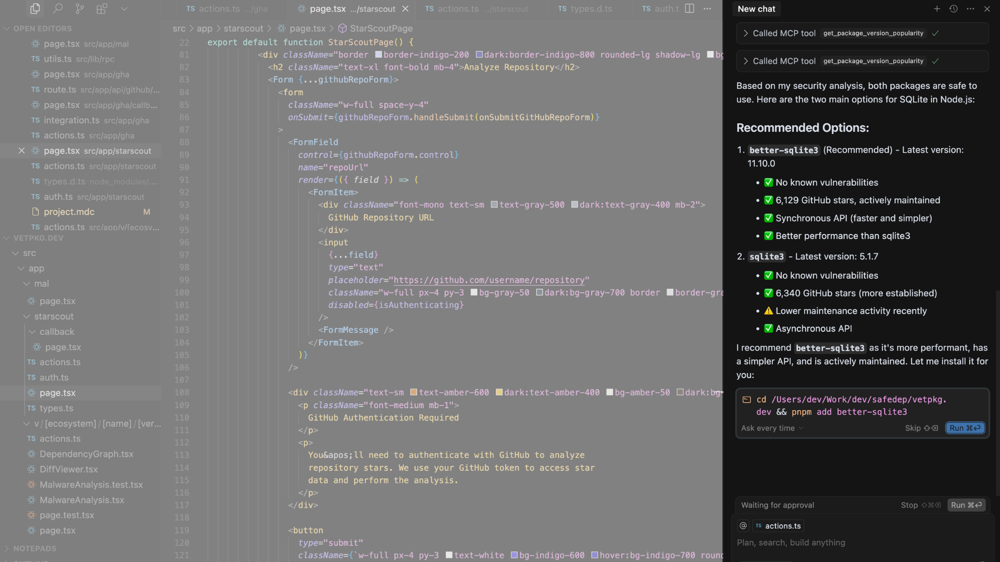

# vet MCP Server

The `vet` MCP server is designed to run locally using `stdio` or `sse` transports.
It provides tools for MCP clients such as Claude Code, Cursor and others to vet
open source packages before they are used in a project through AI generated code.

`vet` MCP server can protect against [Slopsquatting](#) attacks, malicious packages,
vulnerabilities and other security risks.

## Usage

Start the MCP server using SSE transport:

```bash
vet server mcp --server-type sse
```

Start the MCP server using stdio transport:

```bash
vet -s -l /tmp/vet-mcp.log server mcp --server-type stdio
```

> Avoid using `stdout` logging as it will interfere with the MCP server output.

## Configure MCP Client

> **Note:** The example below uses pre-build docker image. You can build your own by running
> `docker build -t ghcr.io/safedep/vet:latest .`

Add following configuration to your MCP client if you are using SSE transport:

```json
{
  "mcpServers": {
    "vet-mcp": {
      "command": "docker",
      "args": [
        "run",
        "--rm",
        "-i",
        "ghcr.io/safedep/vet:latest",
        "-s",
        "-l",
        "/tmp/vet-mcp.log",
        "server",
        "mcp"
      ]
    }
  }
}
```

### Configure IDE

#### Cursor

Add the following to `.cursor/rules/vet-mcp.mdc` file:

```
---
description: vet Open Source Packages using vet MCP server
alwaysApply: true
---

Always use vet-mcp to vet any open source library package suggested by AI generated code before installation.
Follow the rules below to use vet-mcp:

- Try to find the latest version. If not found, it is likely a slopsquatting vulnerability
- Always check for critical vulnerabilities and malware
```

Example usage with Cursor:

