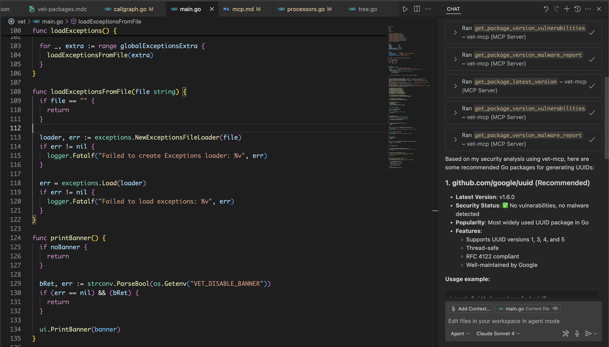

# vet MCP Server

[](https://cursor.com/install-mcp?name=vet-mcp&config=eyJjb21tYW5kIjoiZG9ja2VyIHJ1biAtLXJtIC1pIGdoY3IuaW8vc2FmZWRlcC92ZXQ6bGF0ZXN0IC1zIC1sIC90bXAvdmV0LW1jcC5sb2cgc2VydmVyIG1jcCJ9)

The `vet` MCP server is designed to run locally using `stdio` or `sse` transports.
It provides tools for MCP clients such as Claude Code, Cursor and others to vet
open source packages before they are used in a project through AI generated code.

`vet` MCP server can protect against [Slopsquatting](https://en.wikipedia.org/wiki/Slopsquatting) attacks, malicious packages,
vulnerabilities and other security risks.

## Supported Ecosystems

`vet` MCP server currently supports the following ecosystems:

- npm
- PyPI

## Usage

Start the MCP server using SSE transport:

```bash
vet server mcp --server-type sse
```

Start the MCP server using stdio transport:

```bash
vet -s -l /tmp/vet-mcp.log server mcp --server-type stdio
```

> Avoid using `stdout` logging as it will interfere with the MCP server output.

### SSE Transport Features

The SSE (Server-Sent Events) transport supports:

- **GET requests**: For establishing SSE connections to receive real-time events
- **HEAD requests**: For endpoint health checks and capability probing (useful for tools like Langchain)
- **POST requests**: For sending messages to the MCP server via the message endpoint

The SSE endpoint returns appropriate headers for HEAD requests without a body, allowing tools to verify endpoint availability and capabilities.

### Security: Host and Origin Guards

For SSE, the server enforces simple, user-configurable guards to reduce the risk
of unauthorized cross-origin access and DNS rebinding attacks.

- **Host guard**: Only allows connections whose `Host` header matches an allowed
  host list.
- **Origin guard**: For browser requests, only allows requests whose `Origin`
  starts with an allowed prefix.

These checks are on by default with sensible localhost defaults, and you can
customize them with flags when starting the server.

#### Defaults

- **Allowed hosts**: `localhost:9988`, `127.0.0.1:9988`, `[::1]:9988`
- **Allowed origin prefixes**: `http://localhost:`, `http://127.0.0.1:`, `https://localhost:`

Requests that fail the host check are rejected with status `421`, and requests
that fail the origin check are rejected with status `403`.

#### Customize allowed hosts and origins

You can override the defaults using the following flags:

```bash
vet server mcp \
  --server-type sse \
  --sse-allowed-hosts "localhost:8080,127.0.0.1:8080" \
  --sse-allowed-origins "http://localhost:,https://localhost:"
```

If you are running behind a proxy or using a different port, set both lists to
match your environment. For example, when exposing SSE on port 3001:

```bash
vet server mcp \
  --server-type sse \
  --sse-allowed-hosts "localhost:3001,127.0.0.1:3001" \
  --sse-allowed-origins "http://localhost:,http://127.0.0.1:,https://localhost:"
```

With Docker, append the same flags to the container command:

```bash
docker run --rm -i ghcr.io/safedep/vet:latest \
  server mcp \
  --server-type sse \
  --sse-allowed-hosts "localhost:9988,127.0.0.1:9988" \
  --sse-allowed-origins "http://localhost:,http://127.0.0.1:,https://localhost:"
```

Tip: Non-browser clients may omit the `Origin` header. Those requests are
allowed as long as the host guard passes.

## Configure MCP Client

> **Note:** The example below uses pre-build docker image. You can build your own by running
> `docker build -t ghcr.io/safedep/vet:latest .`

Add following configuration to your MCP client configuration file:

```json
"vet-mcp": {
  "command": "docker",
  "args": [
    "run",
    "--rm",
    "-i",
    "ghcr.io/safedep/vet:latest",
    "-l",
    "/tmp/vet-mcp.log",
    "server",
    "mcp"
  ]
}
```

`vet` uses `stdio` by default, if you wish to use SSE transport, add following args: `"--server-type", "sse"`

**Note:** While `docker` containers can help keep the MCP server process isolated, it needs to be periodically updated to the latest version.

Alternatively, you can use `vet` binary directly as an MCP server using `stdio` transport. Use the following command to start the MCP server:

```bash
vet -l /tmp/vet-mcp.log server mcp --server-type stdio
```

### Configure IDE

#### Cursor

Add `vet-mcp` server to either `.cursor/mcp.json` (project specific configuration) or `~/.cursor/mcp.json` (applies to all projects)

```json
{
  "mcpServers": {
    "vet-mcp": {
      "command": "docker",
      "args": [
        "run",
        "--rm",
        "-i",
        "ghcr.io/safedep/vet:latest",
        "-l",
        "/tmp/vet-mcp.log",
        "server",
        "mcp"
      ]
    }
  }
}
```

Add the following to `.cursor/rules/vet-mcp.mdc` file:

```
---
description: vet Open Source Packages using vet MCP server
alwaysApply: true
---

Always use vet-mcp to vet any open source library package suggested by AI generated code before installation.
Follow the rules below to use vet-mcp:

- Try to find the latest version. If not found, it is likely a slopsquatting vulnerability
- Always check for critical vulnerabilities and malware
```

Example usage with Cursor:


[📄 Cursor MCP server reference](https://docs.cursor.com/context/model-context-protocol#manual-configuration)

#### Visual Studio Code

Add `vet-mcp` server to `.vscode/mcp.json` (project specific configuration)

```json
{
  "servers": {
    "vet-mcp": {
      "command": "docker",
      "args": [
        "run",
        "--rm",
        "-i",
        "ghcr.io/safedep/vet:latest",
        "-l",
        "/tmp/vet-mcp.log",
        "server",
        "mcp"
      ]
    }
  }
}
```

In order to use `vet-mcp` for all projects in Visual Studio Code, add following `mcp` setting in [Visual Studio Code User Settings](https://code.visualstudio.com/docs/copilot/chat/mcp-servers#_add-an-mcp-server-to-your-user-settings) (`settings.json`)

```json
{
  "mcp": {
    "servers": {
      "vet-mcp": {
        "command": "docker",
        "args": [
          "run",
          "--rm",
          "-i",
          "ghcr.io/safedep/vet:latest",
          "-l",
          "/tmp/vet-mcp.log",
          "server",
          "mcp"
        ]
      }
    }
  }
}
```

Add the following to `.github/copilot-instructions.md` file:

```
Always use vet-mcp to vet any open source library package suggested by AI generated code before installation.
Follow the rules below to use vet-mcp:

- Try to find the latest version. If not found, it is likely a slopsquatting vulnerability
- Always check for critical vulnerabilities and malware
```

Example usage with Visual Studio Code:



[📄 Visual Studio Code MCP server reference](https://code.visualstudio.com/docs/copilot/chat/mcp-servers)

#### Claude Code

Add the following to `.mcp.json` in your Claude Code project:

```json
{
  "mcpServers": {
    "vet-mcp": {
      "command": "docker",
      "args": [
        "run",
        "--rm",
        "-i",
        "ghcr.io/safedep/vet:latest",
        "server",
        "mcp"
      ]
    }
  }
}
```

**Note:** You can also use `vet` binary directly as an MCP server using `stdio` transport.
